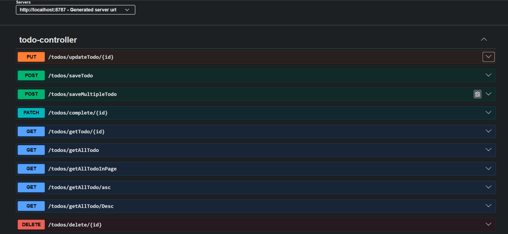
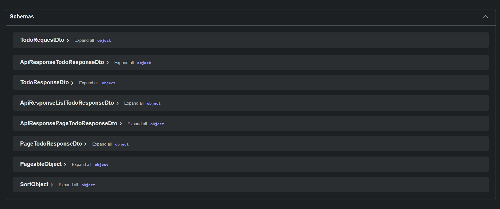

# Todo App (Spring Boot + JavaScript)

A full-stack Todo application built using **Spring Boot (Backend)** and **Vanilla JavaScript (Frontend)**.
This application allows users to efficiently manage daily tasks with complete CRUD functionality and pagination support.

---

## Features

* Add new todos
* View all todos (with pagination)
* Update existing todos
* Delete todos
* Mark todos as completed
* Server-side pagination
* Swagger UI API documentation
* Request & Response DTO architecture
* Global exception handling
* Standardized API responses
* Responsive UI

---

#  Tech Stack

#  Frontend

* HTML
* CSS
* JavaScript (Fetch API)

#  Backend

* Spring Boot
* REST APIs
* Request & Response DTO Architecture
* Validation
* Exception Handling
* Swagger UI Documentation
* API Response Wrapper

## Swagger UI Documentation

### Available REST APIs

### DTO & Response Schemas

#   Database

* MySQL

---

##  Project Architecture

Frontend (HTML/JS) → REST API → Spring Boot Backend → MySQL Database

---
## Important Note

Frontend is currently not fully synchronized with the latest backend APIs due to major backend refactoring and architectural improvements.
Backend APIs and architecture have been significantly enhanced.

### Swagger UI

http://localhost:8787/swagger-ui/index.html

##  How to Run Locally

###  Backend

1. Clone repository
2. Open in IDE (Eclipse / IntelliJ)
3. Configure MySQL database
4. Run Spring Boot application

---

#  Frontend

1. Open `index.html` in browser
2. Ensure backend is running

---

##  Key Highlights

* Implemented full **CRUD operations**
* Used **PATCH method** for partial updates
* Implemented Request/Response DTO architecture
* Added centralized exception handling
* Integrated Swagger UI for API documentation
* Implemented standardized API response structure
* Implemented **server-side pagination**
* Built **clean and responsive UI**
* Followed **RESTful API design principles**

---

##  Author

**Kaif Anwar**
B.Tech CSE 

---
